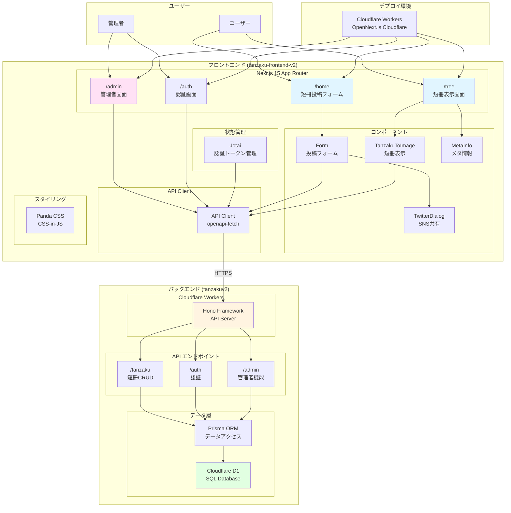
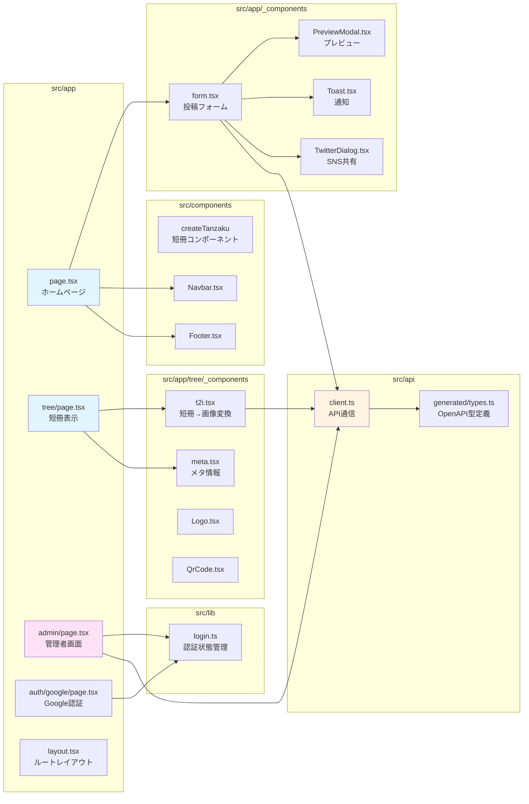
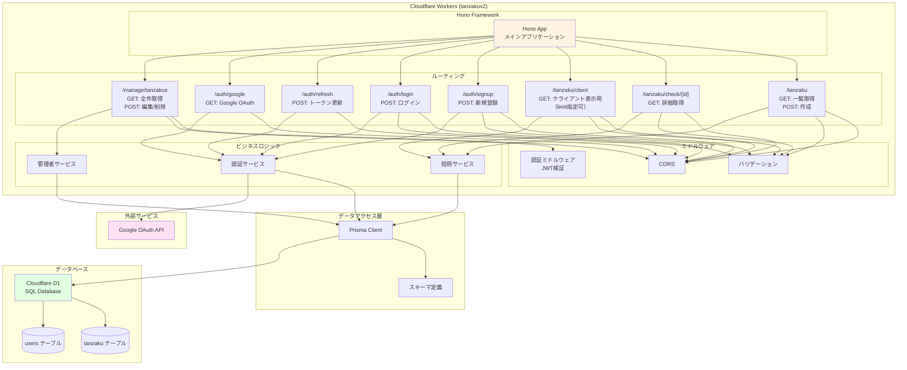
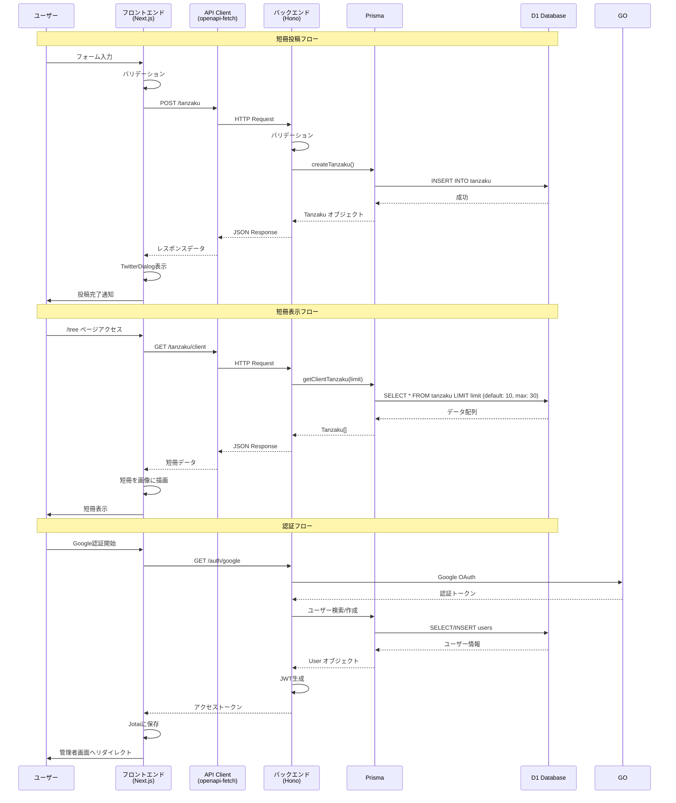

# 短冊システム v2 アーキテクチャ構成図

## システム全体構成

## フロントエンド詳細構成

## バックエンド詳細構成

## データフロー図

## 技術スタック

### フロントエンド (tanzaku-frontend-v2)
- **フレームワーク**: Next.js 15.3.1 (App Router)
- **デプロイ**: Cloudflare Workers (OpenNext.js Cloudflare)
- **スタイリング**: Panda CSS 0.53.7
- **状態管理**: Jotai 2.12.5
- **フォーム**: React Hook Form 7.56.4
- **API通信**: openapi-fetch 0.14.0
- **型生成**: openapi-typescript 7.8.0
- **UIコンポーネント**: React Aria Components 1.9.0
- **アイコン**: Tabler Icons React 3.33.0
- **QRコード**: next-qrcode 2.5.1
- **分析**: Google Analytics (Next.js Third Parties)

### バックエンド (tanzakuv2)
- **ランタイム**: Cloudflare Workers
- **フレームワーク**: Hono
- **ORM**: Prisma
- **データベース**: Cloudflare D1 (SQL)
- **認証**: JWT + Google OAuth
- **API仕様**: OpenAPI 3.0

### インフラ
- **ホスティング**: Cloudflare Workers
- **ドメイン**: tanzaku.mizphses.com (フロントエンド)
- **API**: tanzakuv2.fuminori.workers.dev (バックエンド)
- **CDN**: Cloudflare CDN
