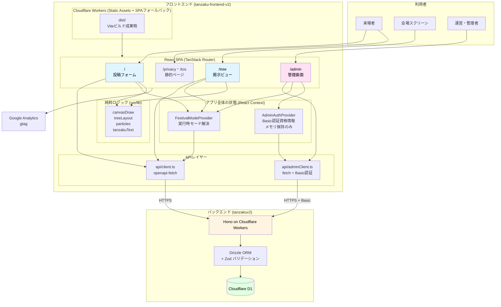
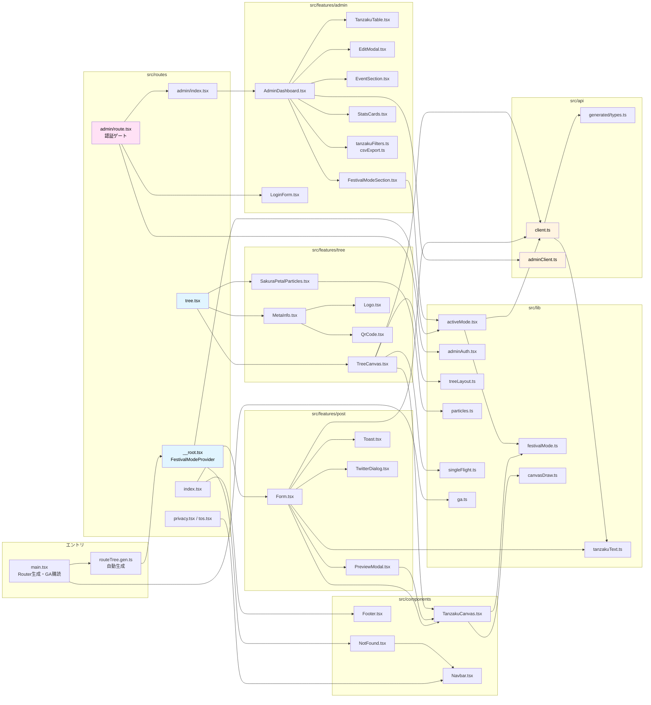
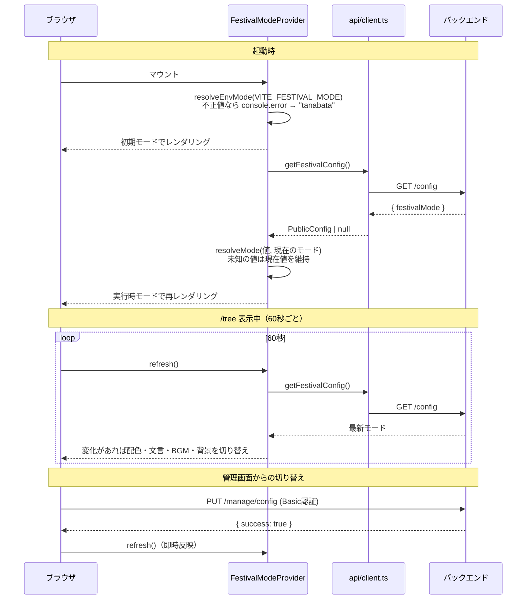
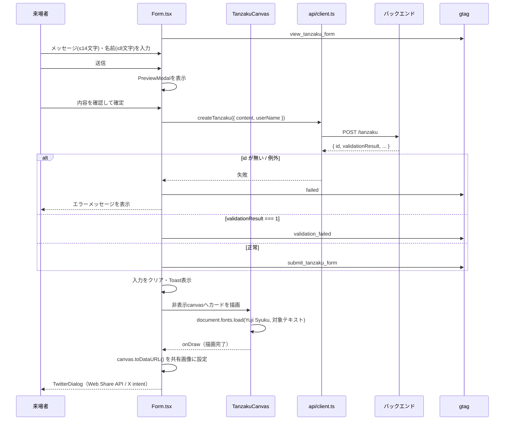
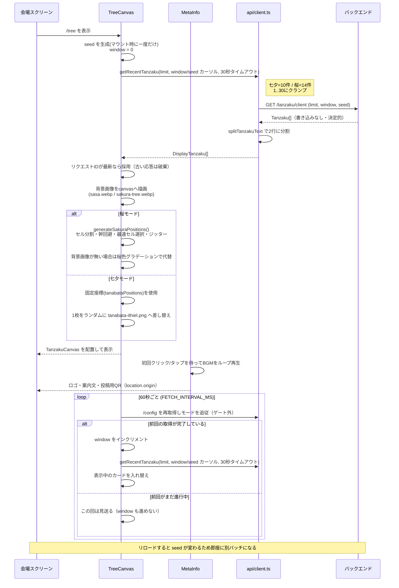
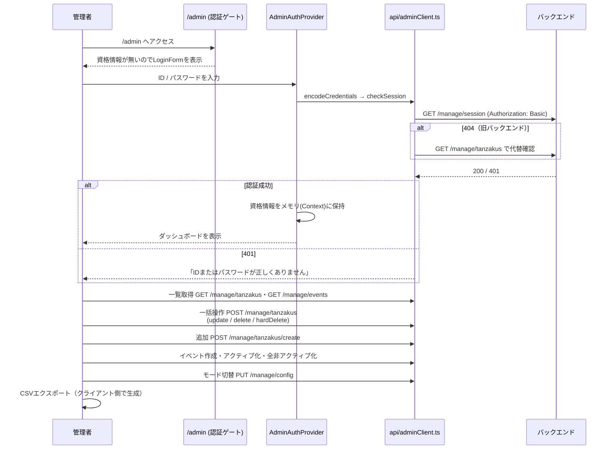
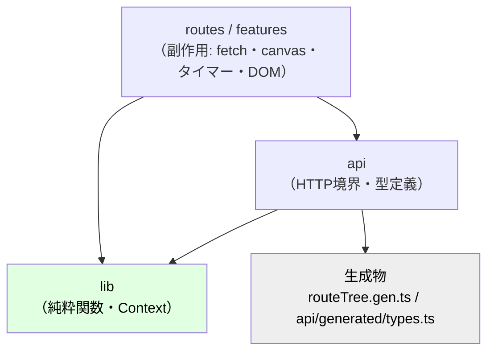

# 短冊システム v2 アーキテクチャ構成図

このドキュメントは **tanzaku-frontend-v2**（Vite + React + TanStack Router のSPA）の構成を示します。バックエンド（[itl-marubu/tanzakuv2](https://github.com/itl-marubu/tanzakuv2)）は別リポジトリで、ここでは連携に必要な範囲のみ記載します。

## システム全体構成

```mermaid
graph TB
    subgraph users["利用者"]
        U[来場者]
        S[会場スクリーン]
        A[運営・管理者]
    end

    subgraph fe["フロントエンド (tanzaku-frontend-v2)"]
        subgraph cf["Cloudflare Workers (Static Assets + SPAフォールバック)"]
            DIST["dist/<br/>Viteビルド成果物"]
        end

        subgraph spa["React SPA (TanStack Router)"]
            R1["/<br/>投稿フォーム"]
            R2["/tree<br/>掲示ビュー"]
            R3["/admin<br/>管理画面"]
            R4["/privacy・/tos<br/>静的ページ"]
        end

        subgraph ctx["アプリ全体の状態 (React Context)"]
            FM[FestivalModeProvider<br/>実行時モード解決]
            AA[AdminAuthProvider<br/>Basic認証資格情報<br/>メモリ保持のみ]
        end

        subgraph apilayer["APIレイヤー"]
            AC["api/client.ts<br/>openapi-fetch"]
            MC["api/adminClient.ts<br/>fetch + Basic認証"]
        end

        subgraph libs["純粋ロジック (src/lib)"]
            LD[canvasDraw<br/>treeLayout<br/>particles<br/>tanzakuText]
        end
    end

    subgraph be["バックエンド (tanzakuv2)"]
        H[Hono on Cloudflare Workers]
        PR["Drizzle ORM<br/>+ Zod バリデーション"]
        D1[(Cloudflare D1)]
    end

    GA[Google Analytics<br/>gtag]

    U --> R1
    S --> R2
    A --> R3
    U --> R4

    DIST --> spa

    R1 --> AC
    R2 --> AC
    R3 --> MC
    R3 --> FM
    R3 --> AA
    R1 --> FM
    R2 --> FM
    FM --> AC
    AA --> MC

    R1 --> LD
    R2 --> LD

    AC -->|HTTPS| H
    MC -->|HTTPS + Basic| H
    spa --> GA

    H --> PR
    PR --> D1

    style R1 fill:#e1f5ff,color:#000
    style R2 fill:#e1f5ff,color:#000
    style R3 fill:#ffe1f5,color:#000
    style H fill:#fff4e1,color:#000
    style D1 fill:#e1ffe1,color:#000
```

## フロントエンド詳細構成

```mermaid
graph LR
    subgraph entry["エントリ"]
        MAIN[main.tsx<br/>Router生成・GA購読]
        RT[routeTree.gen.ts<br/>自動生成]
    end

    subgraph routes["src/routes"]
        ROOT[__root.tsx<br/>FestivalModeProvider]
        P1[index.tsx]
        P2[tree.tsx]
        P3[admin/route.tsx<br/>認証ゲート]
        P4[admin/index.tsx]
        P5["privacy.tsx / tos.tsx"]
    end

    subgraph fpost["src/features/post"]
        FRM[Form.tsx]
        PM[PreviewModal.tsx]
        TO[Toast.tsx]
        TD[TwitterDialog.tsx]
    end

    subgraph ftree["src/features/tree"]
        TC[TreeCanvas.tsx]
        MI[MetaInfo.tsx]
        LG[Logo.tsx]
        QR[QrCode.tsx]
        SP[SakuraPetalParticles.tsx]
    end

    subgraph fadmin["src/features/admin"]
        AD[AdminDashboard.tsx]
        LF[LoginForm.tsx]
        TT[TanzakuTable.tsx]
        EM[EditModal.tsx]
        ES[EventSection.tsx]
        FMS[FestivalModeSection.tsx]
        SC[StatsCards.tsx]
        TF["tanzakuFilters.ts<br/>csvExport.ts"]
    end

    subgraph comp["src/components"]
        TZC[TanzakuCanvas.tsx]
        NB[Navbar.tsx]
        FO[Footer.tsx]
        NF[NotFound.tsx]
    end

    subgraph api["src/api"]
        CL[client.ts]
        MCL[adminClient.ts]
        GT[generated/types.ts]
    end

    subgraph lib["src/lib"]
        AM[activeMode.tsx]
        FMD[festivalMode.ts]
        AAU[adminAuth.tsx]
        CD[canvasDraw.ts]
        TL[treeLayout.ts]
        PA[particles.ts]
        SF[singleFlight.ts]
        TX[tanzakuText.ts]
        GAL[ga.ts]
    end

    MAIN --> RT
    MAIN --> GAL
    RT --> ROOT
    ROOT --> AM
    ROOT --> NF

    P1 --> FRM
    P1 --> FO
    P5 --> NB
    NF --> NB

    FRM --> PM
    FRM --> TO
    FRM --> TD
    FRM --> TZC
    FRM --> CL
    FRM --> TX
    PM --> TZC

    P2 --> TC
    P2 --> MI
    P2 --> SP
    TC --> TZC
    TC --> CL
    TC --> TL
    TC --> SF
    MI --> LG
    MI --> QR
    SP --> PA

    P3 --> AAU
    P3 --> LF
    P3 --> P4
    P4 --> AD
    AD --> TT
    AD --> EM
    AD --> ES
    AD --> FMS
    AD --> SC
    AD --> TF
    AD --> MCL
    FMS --> AM

    TZC --> CD
    TZC --> FMD
    AM --> FMD
    AM --> CL
    CL --> GT
    CL --> TX

    style ROOT fill:#e1f5ff,color:#000
    style P2 fill:#e1f5ff,color:#000
    style P3 fill:#ffe1f5,color:#000
    style CL fill:#fff4e1,color:#000
    style MCL fill:#fff4e1,color:#000
```

## フェスティバルモードの解決フロー

```mermaid
sequenceDiagram
    participant B as ブラウザ
    participant P as FestivalModeProvider
    participant API as api/client.ts
    participant S as バックエンド

    Note over B,S: 起動時
    B->>P: マウント
    P->>P: resolveEnvMode(VITE_FESTIVAL_MODE)<br/>不正値なら console.error → "tanabata"
    P-->>B: 初期モードでレンダリング
    P->>API: getFestivalConfig()
    API->>S: GET /config
    S-->>API: { festivalMode }
    API-->>P: PublicConfig | null
    P->>P: resolveMode(値, 現在のモード)<br/>未知の値は現在値を維持
    P-->>B: 実行時モードで再レンダリング

    Note over B,S: /tree 表示中（60秒ごと）
    loop 60秒
        B->>P: refresh()
        P->>API: getFestivalConfig()
        API->>S: GET /config
        S-->>P: 最新モード
        P-->>B: 変化があれば配色・文言・BGM・背景を切り替え
    end

    Note over B,S: 管理画面からの切り替え
    B->>S: PUT /manage/config (Basic認証)
    S-->>B: { success: true }
    B->>P: refresh()（即時反映）
```

`head()` はコンポーネント外（モジュール評価時）に実行されるため Context を参照できません。`__root` / `privacy` / `tos` のメタ情報は env 由来の初期値を使い、`/tree` のタイトルのみ `document.title` を副作用で更新して実行時モードに追従させています。

## 投稿フロー

```mermaid
sequenceDiagram
    participant U as 来場者
    participant F as Form.tsx
    participant C as TanzakuCanvas
    participant API as api/client.ts
    participant S as バックエンド
    participant GA as gtag

    F->>GA: view_tanzaku_form
    U->>F: メッセージ(≤14文字)・名前(≤8文字)を入力
    U->>F: 送信
    F->>F: PreviewModalを表示
    U->>F: 内容を確認して確定
    F->>API: createTanzaku({ content, userName })
    API->>S: POST /tanzaku
    S-->>API: { id, validationResult, ... }

    alt id が無い / 例外
        API-->>F: 失敗
        F->>GA: failed
        F-->>U: エラーメッセージを表示
    else validationResult === 1
        F->>GA: validation_failed
    else 正常
        F->>GA: submit_tanzaku_form
    end

    F->>F: 入力をクリア・Toast表示
    F->>C: 非表示canvasへカードを描画
    C->>C: document.fonts.load(Yuji Syuku, 対象テキスト)
    C-->>F: onDraw（描画完了）
    F->>F: canvas.toDataURL() を共有画像に設定
    F-->>U: TwitterDialog（Web Share API / X intent）
```

canvasはビットマップのため、描画後にWebフォントが届いても再描画されません。`Yuji Syuku` は unicode-range でサブセット分割されているため、実際に描画するテキストを渡して必要なサブセットの読み込み完了を待ってから描画します。キャプチャも `onDraw` コールバック経由で行い、空白や古い画像を掴まないようにしています。

## 掲示ビュー（/tree）のフロー

```mermaid
sequenceDiagram
    participant D as 会場スクリーン
    participant T as TreeCanvas
    participant M as MetaInfo
    participant API as api/client.ts
    participant S as バックエンド

    D->>T: /tree を表示
    T->>T: seed を生成(マウント時に一度だけ)<br/>window = 0
    T->>API: getRecentTanzaku(limit, window/seed カーソル, 30秒タイムアウト)
    Note right of API: 七夕=10件 / 桜=14件<br/>1..30にクランプ
    API->>S: GET /tanzaku/client (limit, window, seed)
    S-->>API: Tanzaku[]（書き込みなし・決定的）
    API->>API: splitTanzakuText で2行に分割
    API-->>T: DisplayTanzaku[]
    T->>T: リクエストIDが最新なら採用（古い応答は破棄）

    T->>T: 背景画像をcanvasへ描画<br/>(sasa.webp / sakura-tree.webp)
    alt 桜モード
        T->>T: generateSakuraPositions()<br/>セル分割・幹回避・最遠セル選択・ジッター
        T->>T: 背景画像が無い場合は桜色グラデーションで代替
    else 七夕モード
        T->>T: 固定座標(tanabataPositions)を使用
        T->>T: 1枚をランダムに tanabata-ithiel.png へ差し替え
    end
    T-->>D: TanzakuCanvas を配置して表示

    M->>M: 初回クリック/タップを待ってBGMをループ再生
    M-->>D: ロゴ・案内文・投稿用QR（location.origin）

    loop 60秒ごと (FETCH_INTERVAL_MS)
        T->>API: /config を再取得しモードを追従（ゲート外）
        alt 前回の取得が完了している
            T->>T: window をインクリメント
            T->>API: getRecentTanzaku(limit, window/seed カーソル, 30秒タイムアウト)
            T->>T: 表示中のカードを入れ替え
        else 前回がまだ進行中
            T->>T: この回は見送る（window も進めない）
        end
    end

    Note over D,S: リロードすると seed が変わるため即座に別バッチになる
```

### ローテーションの契約

`GET /tanzaku/client` はDBへの書き込みを一切行わない決定的な計算です。同じ `limit`/`window`/`seed` の呼び出しは（データが変わらない限り）常に同じ結果を返します。

- **新着セグメント**: 直近60秒の投稿を新しい順に最大 `limit - 2` 件。`window`/`seed` に依存しないため、リロードを繰り返しても同じ新着が先頭に出ます。60秒以内の投稿がこの枠を超えた場合、溢れた分（古い方）は新着枠から外れて巡回セグメント側に回ります（直近60秒の全件が即座に出る保証ではありません）。
- **巡回セグメント**: 残り枠を、新着以外の安定順序（`createdAt ASC, id ASC`）上の窓で充填します。窓の位置は `offset = (window × 残り枠数 + fnv1a(seed)) mod プール件数` で決まり、末尾に達すると先頭へラップします。
- `window`/`seed` を省略するとサーバーの壁時計から `window` を導出します（カーソル非対応クライアント向けの既定挙動）。

カーソルをクライアントが持つ設計にしているのは、**リロードを「次のバッチへ進める」操作として機能させる**ためです。会場運用ではこれが実質的な手動送りになります。GETに副作用が無いので、動作確認で `curl` を叩いても会場の表示順は進みません。

### ポーリングの安全策

掲示ビューは会場で無人稼働するため、更新が静かに止まらないよう3つのガードを重ねています。

| ガード | 目的 |
| --- | --- |
| リクエストIDガード（`isLatestRequest`） | 遅延した古いバッチの応答が新しいバッチを上書きして表示が巻き戻るのを防ぐ。effectのクリーンアップ時にもIDを進めて無効化する |
| 単発化ゲート（`createSingleFlight`） | 前回の取得が完了していない回のポーリングを見送る。取得を重ねると、レイテンシが60秒を超え続けたときに全応答がIDガードで破棄され、表示が二度と更新されなくなるため |
| 取得タイムアウト（30秒） | 応答が返らないfetchがゲートを占有し続けて、以降のポーリングを止めてしまうのを防ぐ |

中断・タイムアウトによる失敗では `alert` を出しません（`alert` は閉じるまで画面全体をブロックするため、無人の掲示ビューでは致命的）。次の周期で自動的に回復します。それ以外のエラーは従来どおり `alert` で運営に気付かせます。

## 管理画面のフロー

```mermaid
sequenceDiagram
    participant A as 管理者
    participant G as /admin (認証ゲート)
    participant CTX as AdminAuthProvider
    participant MC as api/adminClient.ts
    participant S as バックエンド

    A->>G: /admin へアクセス
    G-->>A: 資格情報が無いのでLoginFormを表示
    A->>CTX: ID / パスワードを入力
    CTX->>MC: encodeCredentials → checkSession
    MC->>S: GET /manage/session (Authorization: Basic)
    alt 404（旧バックエンド）
        MC->>S: GET /manage/tanzakus で代替確認
    end
    S-->>MC: 200 / 401
    alt 認証成功
        CTX->>CTX: 資格情報をメモリ(Context)に保持
        CTX-->>A: ダッシュボードを表示
    else 401
        MC-->>A: 「IDまたはパスワードが正しくありません」
    end

    A->>MC: 一覧取得 GET /manage/tanzakus・GET /manage/events
    A->>MC: 一括操作 POST /manage/tanzakus<br/>(update / delete / hardDelete)
    A->>MC: 追加 POST /manage/tanzakus/create
    A->>MC: イベント作成・アクティブ化・全非アクティブ化
    A->>MC: モード切替 PUT /manage/config
    A->>A: CSVエクスポート（クライアント側で生成）
```

資格情報は `localStorage` / `sessionStorage` に保存せず、React Context（メモリ）にのみ保持します。XSS時の露出範囲を抑えるための選択で、リロードすると再ログインが必要になるトレードオフを受け入れています。CORSの都合上 `credentials: "omit"` とし、`Authorization: Basic` ヘッダーを毎リクエスト手動で付与します。

## レイヤリング方針

```mermaid
graph TD
    L1["routes / features<br/>（副作用: fetch・canvas・タイマー・DOM）"]
    L2["api<br/>（HTTP境界・型定義）"]
    L3["lib<br/>（純粋関数・Context）"]
    L4["生成物<br/>routeTree.gen.ts / api/generated/types.ts"]

    L1 --> L2
    L1 --> L3
    L2 --> L3
    L2 --> L4

    style L3 fill:#e1ffe1,color:#000
    style L4 fill:#eeeeee,color:#000
```

- 配置計算・カード描画・テキスト分割・パーティクル・管理画面のフィルタ／ソート／統計は純粋関数として `src/lib` と `features/admin/*.ts` に切り出し、Vitest（`environment: node`）で検証します。
- `routeTree.gen.ts` と `api/generated/types.ts` は自動生成物で、Biomeの対象からも除外しています。手で編集しません。
- `/config`・`/manage/*` は OpenAPI v2.0.0 に収録済みですが、コード上は手書き型のまま呼び出しています（`/manage/*` は Basic認証ヘッダーを毎リクエスト付与する都合、`/config` は素の `fetch`）。

## 技術スタック

### フロントエンド (tanzaku-frontend-v2)

| 分類 | 採用技術 |
| --- | --- |
| ビルド | Vite 8 |
| UI | React 19 |
| ルーティング | TanStack Router 1.x（ファイルベース・自動コード分割） |
| スタイリング | Tailwind CSS 4（`@tailwindcss/vite`） |
| 状態管理 | React Context（FestivalMode / AdminAuth）+ ローカルstate |
| API通信 | openapi-fetch 0.14（公開API）/ fetch ラッパー（管理API）。掲示ビューのポーリングは単発化ゲート + 30秒タイムアウト |
| 型生成 | openapi-typescript 7 |
| QRコード | qrcode 1.5 |
| 描画 | Canvas 2D API |
| テスト | Vitest 4 |
| Lint / Format | Biome 1.9 |
| 分析 | Google Analytics（gtag、SPA遷移時に手動 page_view） |

### バックエンド (tanzakuv2) — 参考

| 分類 | 採用技術 |
| --- | --- |
| ランタイム | Cloudflare Workers |
| フレームワーク | Hono（`@hono/zod-validator` でリクエスト検証） |
| ORM | Drizzle ORM（route / service / repository のレイヤード構成） |
| データベース | Cloudflare D1 |
| API仕様 | OpenAPI 3.0（`scripts/bin/openapi.yml` として取り込み） |
| 管理API認証 | Basic認証（fail-closed） |

OpenAPI仕様は v2.0.0 でアカウント系（`/auth/*`、Bearer / JWT）の定義ごと撤去され、認証方式はBasic認証のみになりました。フロントエンド側もGoogleログイン導線と認証スタックを撤去済みで、管理画面はBasic認証に統一されています。

### インフラ

- **ホスティング**: Cloudflare Workers（Static Assets、`not_found_handling: single-page-application`）
- **フロントエンドドメイン**: `tanzaku.mizphses.com`
- **バックエンドAPI**: `https://tanzakuv2.fuminori.workers.dev`
- **デプロイ**: GitHub Actions の手動実行（フェスティバルモードを選択してビルド → `wrangler deploy` → Release作成）
