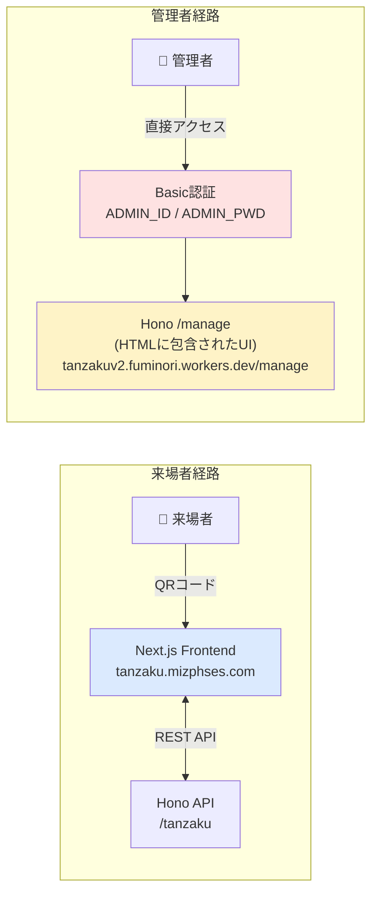
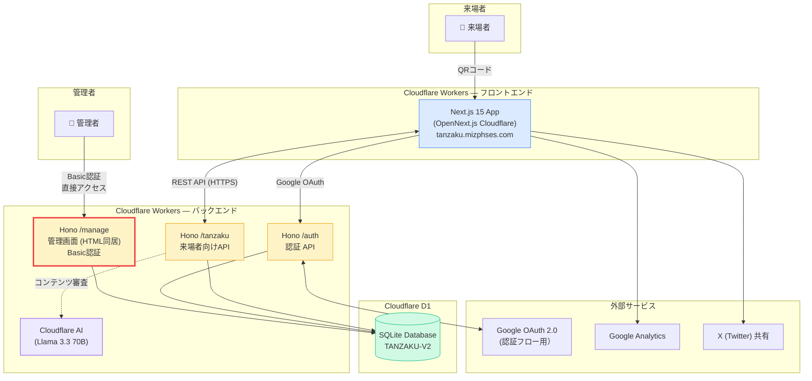
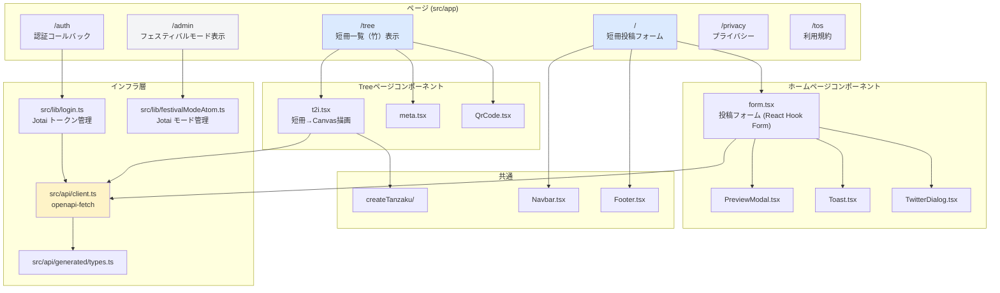
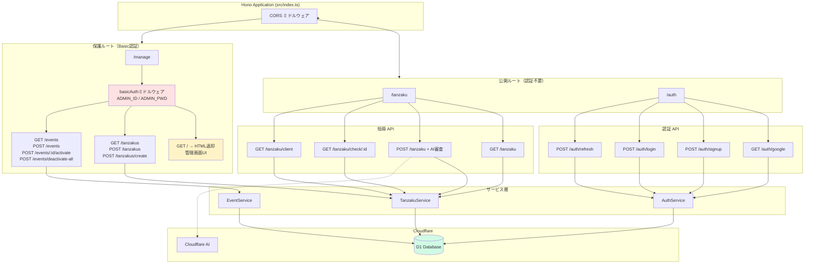
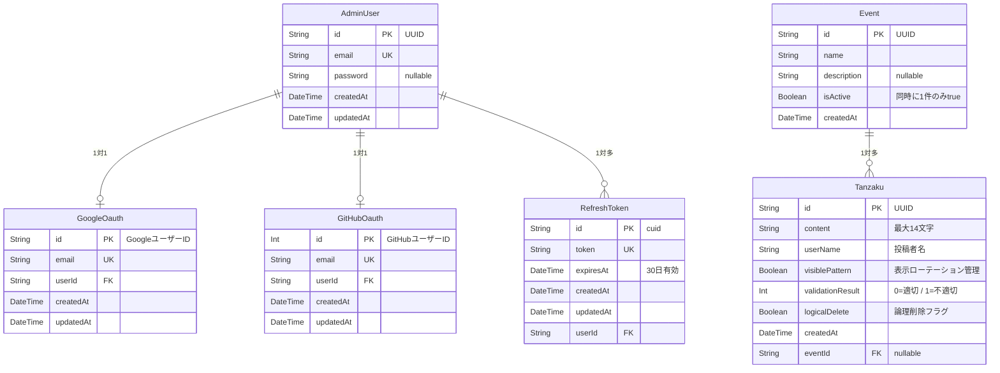
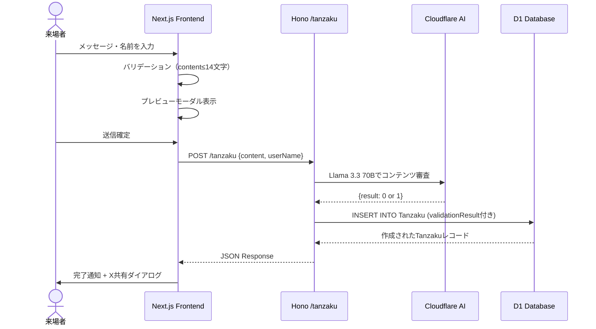
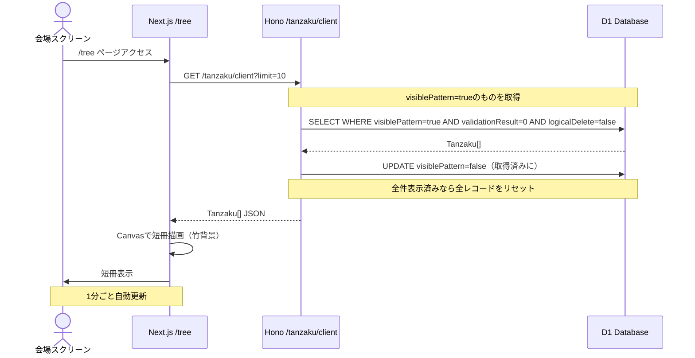
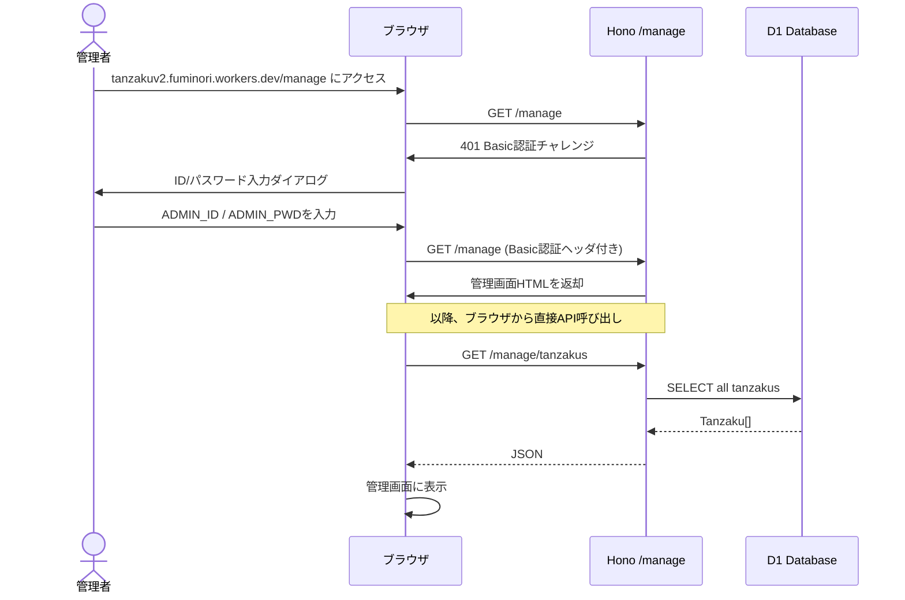
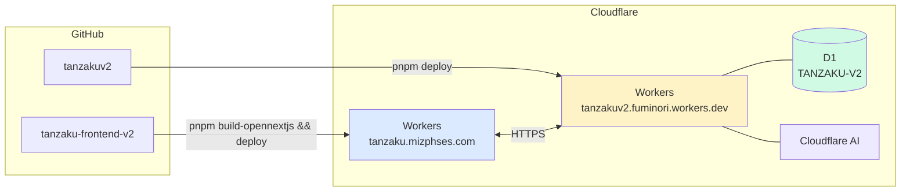

# iTL七夕祭 短冊システム — システム説明書

> 対象リポジトリ: `tanzakuv2`（バックエンド）/ `tanzaku-frontend-v2`（フロントエンド）

---

## 1. システム概要

iTL七夕祭に来場した参加者が、スマートフォンやPCから「短冊」にメッセージと名前を書いて投稿し、会場スクリーンに竹へ飾られた短冊としてリアルタイムで表示するWebアプリケーション。

| 項目 | 内容 |
|------|------|
| サービス名 | iTL七夕祭 短冊アプリ |
| フロントエンドURL | `tanzaku.mizphses.com` |
| バックエンドURL | `tanzakuv2.fuminori.workers.dev` |
| 対象ユーザー | 七夕祭来場者・運営管理者 |
| 主な利用シーン | QRコードで来場者がアクセスして短冊投稿、会場スクリーンに `/tree` を表示して短冊をリアルタイム上映 |

---

## 2. アクセス経路の分離

来場者と管理者ではアクセス経路が完全に分離されています。

| 層 | 経路 | 認証方式 | 主な機能 |
|---|---|---|---|
| 来場者 | `tanzaku.mizphses.com` → Next.js | なし | 短冊投稿・閲覧 |
| 管理者 | `tanzakuv2.fuminori.workers.dev/manage` → Hono直届けHTML | Basic認証 | 短冊管理・イベント管理 |

---

## 3. 主な機能

### 来場者向け（`tanzaku.mizphses.com`）

| 機能 | 詳細 |
|------|------|
| 短冊作成・投稿 | メッセージ（最大14文字）と名前（最大8文字）を入力して送信 |
| プレビュー | 送信前にモーダルで短冊の見た目を確認 |
| SNS共有 | 投稿後にCanvas描画した短冊画像をXへ共有 |
| 短冊閲覧 | `/tree` で竹に飾られた短冊をリアルタイム表示（1分ごと自動更新） |
| フェスティバルモード | `NEXT_PUBLIC_FESTIVAL_MODE` 環境変数で「七夕」/「桜まつり」を切替 |

### 管理者向け（`tanzakuv2.fuminori.workers.dev/manage`）

管理画面はHonoバックエンドが**HTML/CSS/JavaScriptを直接返却**する構成で、Basic認証で保護されています。

| 機能 | 詳細 |
|------|------|
| 短冊一覧 | 全短冊を表示。検索・フィルタ・ソート対応 |
| 短冊編集・削除 | 個別・一括の編集・論理削除・完全削除 |
| バリデーション切替 | AI審査結果（適切/不適切）を手動で修正 |
| イベント管理 | 複数イベントの作成・有効化・切替 |
| CSV出力 | 表示中の短冊データをCSVダウンロード |
| 新規作成 | 管理画面から直接短冊を作成（AI審査なし） |

---

## 4. システム全体構成図

---

## 5. フロントエンド詳細構成図

> **注意**: フロントエンドの `/admin` はフェスティバルモードの表示のみであり、**短冊管理画面はバックエンドの `/manage`** に実装されています。

---

## 6. バックエンド詳細構成図

---

## 7. データモデル（ERD）

---

## 8. 主要データフロー

### 短冊投稿フロー

### 短冊表示フロー（/tree ページ）

### 管理者アクセスフロー（Basic認証）

---

## 9. APIエンドポイント一覧

### 来場者向け短冊 API (`/tanzaku`)

| メソッド | パス | 認証 | 説明 |
|----------|------|------|------|
| GET | `/tanzaku` | 不要 | 全短冊取得（イベント情報含む） |
| POST | `/tanzaku` | 不要 | 短冊作成（AI審査付き） |
| GET | `/tanzaku/check/:id` | 不要 | ID指定で短冊取得 |
| GET | `/tanzaku/client` | 不要 | 表示用取得（循環ローテーション、`?limit=N`） |

### 認証 API (`/auth`)

| メソッド | パス | 説明 |
|----------|------|------|
| GET | `/auth/google` | Google OAuth 開始 |
| POST | `/auth/signup` | メールアドレス登録 |
| POST | `/auth/login` | メールアドレスログイン |
| POST | `/auth/refresh` | アクセストークン更新 |

### 管理者向け API (`/manage`) — Basic認証必須

| メソッド | パス | 説明 |
|----------|------|------|
| GET | `/manage` | 管理画面HTMLを返却 |
| GET | `/manage/tanzakus` | 全短冊取得 |
| POST | `/manage/tanzakus` | 短冊編集・論理削除・完全削除 |
| POST | `/manage/tanzakus/create` | 短冊新規作成（AI審査なし） |
| GET | `/manage/events` | イベント一覧取得 |
| POST | `/manage/events` | イベント作成 |
| POST | `/manage/events/:id/activate` | イベントをアクティブ化 |
| POST | `/manage/events/deactivate-all` | 全イベントを無効化 |

---

## 10. 技術スタック

### フロントエンド (tanzaku-frontend-v2)

| カテゴリ | ライブラリ / ツール | バージョン |
|----------|---------------------|------------|
| フレームワーク | Next.js (App Router) | 15.3.1 |
| UIライブラリ | React | 19.1.0 |
| 言語 | TypeScript | 5.8.3 |
| スタイリング | Panda CSS | 0.53.7 |
| 状態管理 | Jotai | 2.12.5 |
| フォーム | React Hook Form | 7.56.4 |
| APIクライアント | openapi-fetch | 0.14.0 |
| 型生成 | openapi-typescript | 7.8.0 |
| アイコン | Tabler Icons | 3.33.0 |
| QRコード | next-qrcode | 2.5.1 |
| 分析 | Google Analytics | — |
| Linter/Formatter | Biome | — |
| デプロイ | Cloudflare Workers (OpenNext.js) | — |
| ドメイン | tanzaku.mizphses.com | — |

### バックエンド (tanzakuv2)

| カテゴリ | ライブラリ / ツール | バージョン |
|----------|---------------------|------------|
| ランタイム | Cloudflare Workers | — |
| フレームワーク | Hono | — |
| ORM | Prisma (PrismaD1アダプター) | — |
| データベース | Cloudflare D1 (SQLite) | — |
| 認証(管理画面) | Basic認証 (Hono basicAuth) | — |
| 認証(JWT) | JWT + Google OAuth (@hono/oauth-providers) | — |
| パスワード | bcryptjs | — |
| AI審査 | Cloudflare AI (Llama 3.3 70B fp8) | — |
| API仕様 | OpenAPI 3.0 | — |
| Linter/Formatter | Biome | — |
| パッケージ管理 | pnpm | — |

---

## 11. デプロイ構成

---

## 12. 環境変数

### フロントエンド

| 変数名 | 説明 |
|--------|------|
| `NEXT_PUBLIC_TANZ_BACKEND` | バックエンドAPIのベースURL |
| `NEXT_PUBLIC_GA_ID` | Google Analytics 計測ID（任意） |
| `NEXT_PUBLIC_FESTIVAL_MODE` | `tanabata` または `sakura`（フェスティバル切替） |

### バックエンド（Cloudflare Workers Bindings）

| Binding / 変数名 | 説明 |
|-----------------|------|
| `DB` | Cloudflare D1 Binding |
| `AI` | Cloudflare AI Binding |
| `JWT_SECRET` | JWT署名シークレット |
| `FRONTEND_BASEURL` | フロントエンドのベースURL（OAuth リダイレクト用） |
| `ADMIN_ID` | 管理画面Basic認証のユーザー名 |
| `ADMIN_PWD` | 管理画面Basic認証のパスワード |
